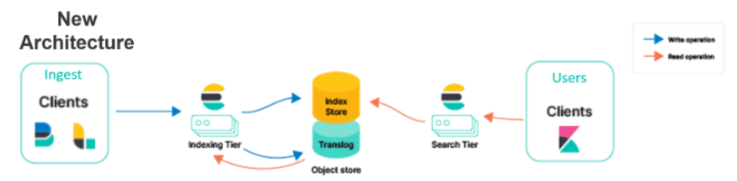

# ELK Stack NetworkLab Project



## Overview
This project sets up an **ELK Stack** (Elasticsearch, Logstash, Kibana) for a NetworkLab environment. It centralizes syslogs to enable **predictive failure detection** and more efficient troubleshooting. Deployment is automated with **Ansible** or **Puppet**.

## Objectives
- Centralize and analyze syslogs from network devices and servers  
- Automate ELK Stack deployment and configuration  
- Provide real-time dashboards in Kibana  
- Enable predictive analysis for potential failures  
- Improve operational efficiency and reduce downtime  

## Components
- **Elasticsearch**: Stores and indexes logs for search and analysis  
- **Logstash**: Collects, parses, and transforms logs  
- **Kibana**: Visualizes logs with dashboards, alerts, and reports  
- **Ansible / Puppet**: Automates deployment and ensures consistency  

## Setup

### Prerequisites
- Linux servers for ELK components  
- Access to network devices for syslog forwarding  
- Ansible or Puppet installed on the control node  

### Deployment (Ansible)
```bash
git clone <repository_url>
cd <project_directory>
ansible-playbook -i inventory elk_setup.yml

